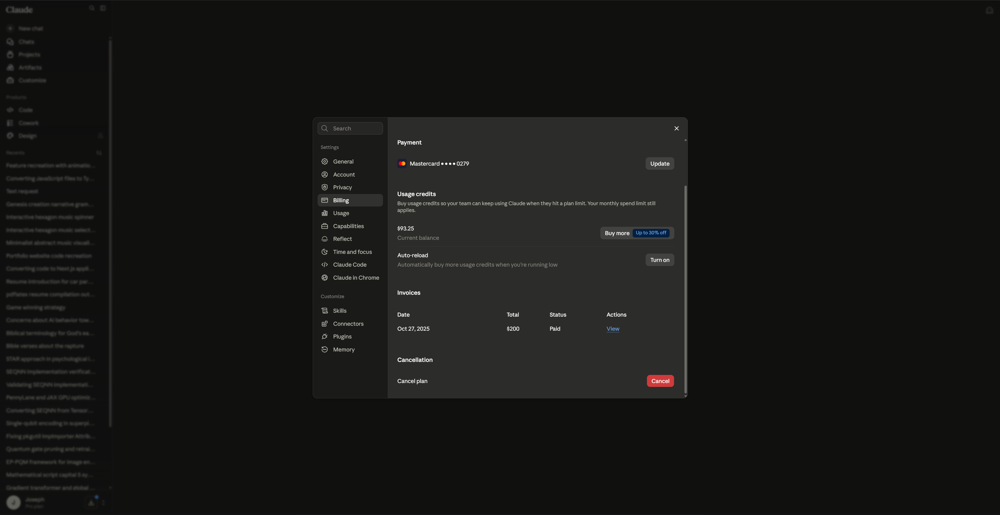
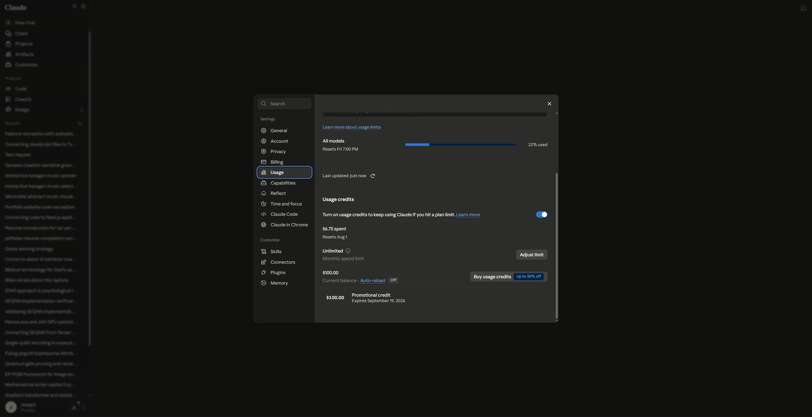
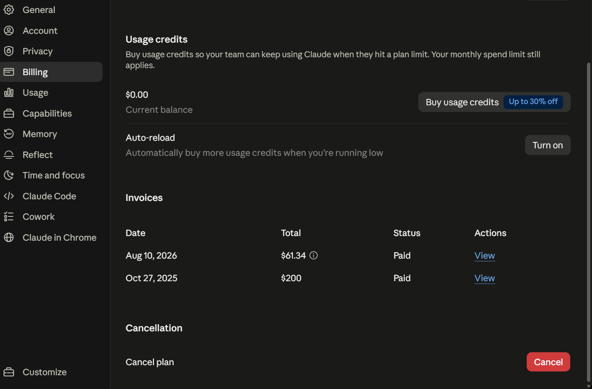

# Let there be (Docket) ~ Designed, Prompted, and Coded with Claude AI

## Sites

- <a href="https://docketsnotes.vercel.app" target="_blank">docketsnotes.vercel.app</a>
- <a href="https://docketnotes.netlify.app" target="_blank">docketnotes.netlify.app</a>

---

## Tech Stack

1. React
2. xState
3. Framer motion
4. Anime.js

## Storage

Session Storage and local storage is being used temporarily.

## TODO

- Some or all notes during delete animation the note became shrinked-square like the note shape itself since <a href="https://github.com/josephchay/docket-notes/tree/71dbccb3d8b35017268a152894c92bc2065bcac1" target="_blank">71dbccb3d8b35017268a152894c92bc2065bcac1</a>, instead of circle instead like in commit: <a href="https://github.com/josephchay/docket-notes/tree/6d44f9e460ce52f49906022e3bc3965baf9c896c" target="_blank">6d44f9e460ce52f49906022e3bc3965baf9c896c</a>
- Sound cues (enabled/disabled in Settings panel) only play for some interactables
- Check the QuickDock functionality, if there is any bug issue under this commit <a href="https://github.com/josephchay/docket-notes/tree/53d2ad204aa70353fc4a227bf2344b8dda60924e " target="_blank">53d2ad204aa70353fc4a227bf2344b8dda60924e</a>
- Check the TagThreads functionality, if there is any bug issue under this commit. <a href="https://github.com/josephchay/docket-notes/tree/ccc6d09d64ac98a183c0550521231babd1cbc245 " target="_blank">ccc6d09d64ac98a183c0550521231babd1cbc245</a>
- Check the NoteList and the FluidVisualizer, if there is any bug issue under this commit.

## Acknowledgements

1. Design inspired from <a href="https://dribbble.com/shots/14037848-Docket-note-Side-menu" target="_blank">Docket Note</a>
2. Side menu animation inspiration and code from <a href="https://www.youtube.com/watch?v=lSzfYAQYKU0" target="_blank">Micro Interactions using Anime.js | HTML, CSS & Javascript</a>
3. Designs and codes helped and made with <a href="https://claude.ai/" target="_blank">Claude AI</a> (Paid - invoice can be shared upon request), after commit <a href="https://github.com/josephchay/docket-notes/tree/5fcc14fe8b9dcf6bce6d23789cacaa6043f80d08" target="_blank">5fcc14fe8b9dcf6bce6d23789cacaa6043f80d08</a>
    - Subscriptions Proofs in <a href="src/assets/miscellaneous" target="_blank">src/assets/miscellaneous</a>
        
        
        
    - Consistent sample script prompts used: <a href="claude-ai-sample-prompt-scripts" target="_blank">Claude AI Sample Script Prompts</a>
